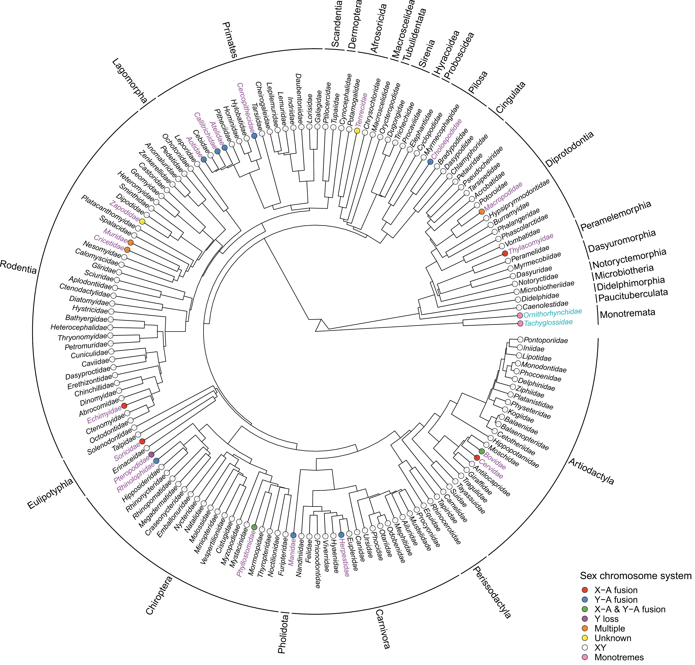
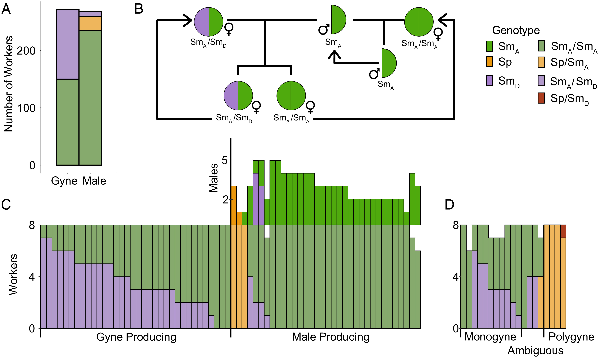
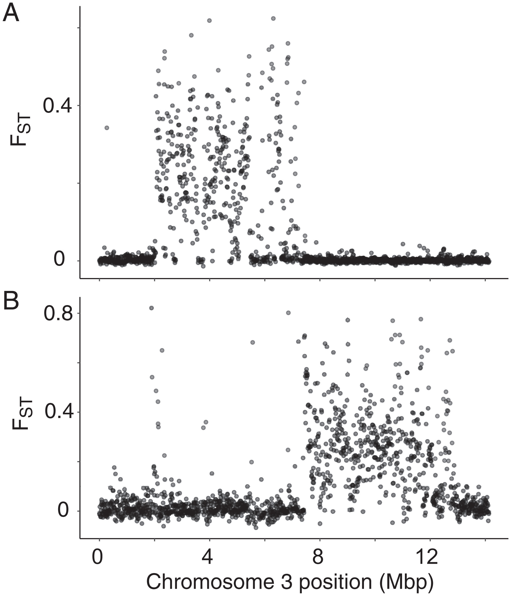

As an evolutionary biologist, I am fundamentally interested in how genome evolution can maintain diverging traits. I have explored this question through the lens of genomic structural variation. Structural variation can play a key role in maintaining differences between alternative phenotypes, such as phenotypic morphs and life history strategies. Genomic regions containing two or more linked functional mutations that control discrete traits are often referred to as “supergenes.” Oftentimes, supergenes are inversions, but other structural variants and ploidy differences, such as hemizygosity, fall under the supergene umbrella. Sex chromosomes are considered a special case of a supergene and much of the theoretical literature for supergene evolution builds on what we understand about sex chromosome evolution.

**_Ongoing work_**

Most of our understanding of sex chromosomes come from static and stable systems, where there isn’t much change occurring. New, or “neo,” sex chromosomes allow us to gain a glimpse of the the early stages of genomic evolution since old sex chromosomes can fuse to autosomes allowing for the process to play out again (and allow us to study early stages!). I am using comparative genomics and population genomics methods to understand how and why multiple neo-sex chromosomes are maintained in the mountain pine beetle. This question is not only fascinating from a genome evolution perspective, but also, from a speciation perspective where sex differences and incompatibilities can often be a pathway to species divergence. More to come on this!

**Sex chromosome evolution**

Recently, my collaborators and I documented the variant sex chromosomes in what is typically regarded as a static and stable sex chromosome system, the mammal X and Y. In our recent review on variant sex chromosomes in mammals <a href="https://doi.org/10.1093/jhered/esae031" target="_blank" rel="noopener noreferrer">(Hughes, Lagunas-Robles, & Campbell 2024)</a>, we show that variant sex chromosomes are abundant based on published karyotype data. We also discuss the role of genomic and sexual conflict in the evolution of variant sex chromosome systems.

_Figure1 from <a href="https://doi.org/10.1093/jhered/esae031" target="_blank" rel="noopener noreferrer">(Hughes, Lagunas-Robles, & Campbell 2024, _Journal of Heredity_)</a>: Family level phylogeny of Mammalia: Families with species having variant sex chromosomes in purple. Monotremes in blue. The key has the sex chromosome system categories._

**Evolution of complex traits**

Complex traits that are inherited as a simple Mendelian unit are fascinating. During my Ph.D. dissertation, I worked in the _Formica_ ant system. _Formica_ ants have a supergene that determines colony queen number that is ~30 million years old <a href="https://onlinelibrary.wiley.com/doi/abs/10.1111/mec.16196" target="_blank" rel="noopener noreferrer">(Purcell, Lagunas-Robles, Rabeling, Borowiec, & Brelsford 2021, _Molecular ecology_) </a>! I was interested in understanding whether colony sex ratio could be associated with this "social" supergene as colonies specializing in my male production are expected to have many queens (=polygyne) and colonies specializing in producing future queens (or gynes) are expected to have a single queen (=monogyne). There is an elegant body of literature on sex ratios in ants and I cannot do it justice here but see <a href="https://academic.oup.com/beheco/article-abstract/19/2/382/213557" target="_blank" rel="noopener noreferrer">Meunier et. al. 2008</a> for a review. I hypothesized that colonies with the _M_ haplotype (monogyne-associated in other _Formica_ species) would produce gynes and colonies with _P_ haplotype (polygyne-associated in other _Formica_ species) would produce males. 

_Figure4 from <a href="https://www.pnas.org/doi/epub/10.1073/pnas.2101427118" target="_blank" rel="noopener noreferrer">(Lagunas-Robles, Purcell, & Brelsford 2021, _PNAS_)</a>: A) Genotype count in the population between colonies producing gynes and colonies producing males. B) Proposed inhertiance mechanism. C) Colony level genotypes between gyne producing and male producing colonies showing the_ MD _is associated with producing gynes. D) Using colonies spread across the Alaska, British Columbia, and Alberta, we found a similar distribution of genotypes with all the colonies with the_ P _haplotype producing males._

Instead, my collaborators and I found something unexpected! There were two _M_ haplotypes, the _MD_ and the _MA_ <a href="https://www.pnas.org/doi/epub/10.1073/pnas.2101427118" target="_blank" rel="noopener noreferrer">(Lagunas-Robles, Purcell, & Brelsford 2021)</a>. Colonies that were heterozygous for the _MD_ were producing gynes, while colonies that were homozygous for the _MA_ were producing males. The _P_ haplotype was present in our population at a low frequency and the colonies with a _P_ haplotype were producing males.

_Figure2 from <a href="https://www.pnas.org/doi/epub/10.1073/pnas.2101427118" target="_blank" rel="noopener noreferrer">(Lagunas-Robles, Purcell, & Brelsford 2021, _PNAS_)</a>: A) Genetic differentiation between_ MD/MA _workers vs_ MA/MA _workers. B) Genetic differentiation between_ P/MA _workers vs_ MA/MA _workers._

Additionally, we found that the _P_ haplotype had changed in structure. In the species _Formica glacialis_, instead of spanning ~2Mbp-12.5Mbp, the _P_ haplotype only spanned the second half of that region ~7.5Mbp-12.5Mbp. The _MD_ and the _MA_ haplotypes are differentiated from ~2Mbp-7.5Mbp. While this work showed that the ancient supergene system is still dynamic and evolving, other work I led in another group of  _Formica_ species that are famously recognized for their large multi-queen nests lack the _P_ haplotype suggesting that the ancient _P_ haplotype is not necessary for multi-queen nests in some _Formica_ species <a href="https://www.biorxiv.org/content/10.1101/2024.09.15.613148v1.abstract" target="_blank" rel="noopener noreferrer">(Lagunas-Robles, Alam, & Brelsford 2024 _in review_)</a>.
